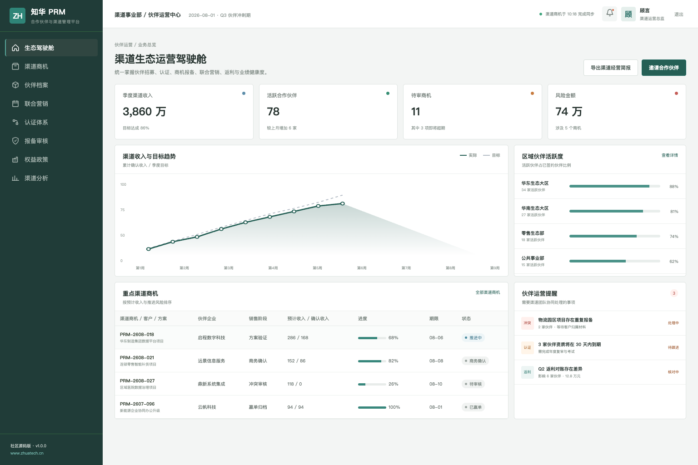
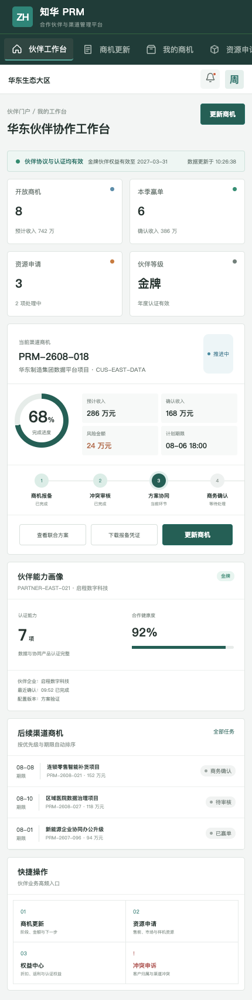

# ZhuaTech PRM｜知华科技合作伙伴与渠道管理平台

> 面向品牌商、渠道团队和生态伙伴的伙伴关系管理社区源码版。

[知华科技官网](https://www.zhuatech.cn/) · [快速部署](deploy/README.md) · [接口说明](docs/api.md) · [许可边界](LICENSE)

ZhuaTech PRM 由知华科技（上海如静知华信息科技有限公司）发布，围绕伙伴招募、资质认证、商机报备、联合营销、权益政策、返利核算和渠道分析形成业务闭环。工程采用 Java + Vue 前后端分离架构，同时提供企业管理端和伙伴 H5 工作台。

## 产品现场

### 渠道运营人员：一屏掌握生态增长



驾驶舱集中呈现渠道收入、区域活跃度、重点商机、冲突报备和伙伴健康度，适合渠道总监及运营团队进行日常经营复盘。

### 合作伙伴：在移动端协同推进商机



伙伴经理可完成商机更新、资源申请、权益查询与渠道冲突申诉，减少邮件和线下表格往返。

## 核心业务地图

```text
伙伴招募 → 准入签约 → 能力认证 → 商机报备 → 联合跟进 → 赢单确认 → 返利结算
```

- 伙伴档案、组织联系人、区域与行业覆盖
- 等级体系、能力认证、课程考试与年度复审
- 商机保护、重复校验、冲突仲裁与协作时间线
- 联合营销活动、线索回传与市场资源申请
- 折扣、返利、权益政策和伙伴绩效分析

演示中的企业、客户、金额和人员均为虚构数据。

## 技术组成

| 范围 | 实现 |
| --- | --- |
| 服务端 | Java 21、Spring Boot、Spring Security、JWT、JPA、Flyway |
| Web / H5 | Vue 3、Pinia、Vue Router、Axios、Vite |
| 数据库 | MySQL 8；测试环境使用 H2 |
| 交付 | Docker Compose、Nginx、环境变量 |

工程包名为 `cn.zhuatech.prm`，默认数据库为 `zhuatech_prm`。

## 五分钟体验

```bash
cd frontend
npm install
npm run dev:demo
```

访问 `http://localhost:5173`。企业管理端账号 `planner / Demo@2026`，伙伴端账号 `operator / Demo@2026`。全栈启动可执行 `cp .env.example .env && docker compose up --build`。

## 使用许可与商业合作

本工程仅允许个人学习、研究和非商业技术交流，**不得用于商业用途**。企业内部使用、生产部署、SaaS 服务、项目交付、收费培训、咨询实施、品牌替换或商业再分发，均须事先获得上海如静知华信息科技有限公司书面授权，具体以 [LICENSE](LICENSE) 为准。

渠道数字化、伙伴门户、CRM/ERP 集成、私有化部署及深度定制，请访问[知华科技官网](https://www.zhuatech.cn/)或扫码咨询：

| 微信咨询一 | 微信咨询二 |
| --- | --- |
|  |  |

SEO 关键词：PRM 系统源码、伙伴关系管理、渠道管理系统、伙伴门户、商机报备、渠道返利、Java PRM、Vue 渠道系统、知华科技。
